<!-- Typing SVG — keep the subtle animated tagline -->

<!-- Clean live stats — single row, single accent color -->

  
  
  
  

## `01` &nbsp; About

<code>// who · what · why</code>

I'm a systems engineer working across three areas that rarely live in the same person's head: **Android kernel performance**, **full-stack web applications**, and **applied AI / LLM systems**. The throughline is performance and lower-layer thinking — whether that means tuning DVFS on a Snapdragon 888, optimizing a Next.js serverless bundle, or wiring a multi-agent orchestration graph.

**Kernel &amp; Android systems.** I build KernelSU / Magisk modules that ship adaptive performance profiles for Xiaomi devices. My recent work put a small on-device reinforcement-learning agent in charge of CPU/GPU governor selection on Snapdragon 888 hardware, achieving a 30% battery-life gain with no measurable frame-rate loss. I also maintain a serverless HyperOS ROM-porting pipeline that runs entirely on GitHub Actions.

**Full-stack web.** I ship production web apps with Next.js 16, TypeScript, Tailwind CSS, Prisma, and Supabase. The largest is the AVYSTRA Consulting marketing site and OGI assessment platform — a single-page app with GSAP animations, automated email delivery, Excel export, and a Postgres-backed submission flow. I've also built a FastAPI + React 19 finance tracker with Gemini-powered transaction analysis, a real-time Socket.io chat app, and a client-side QR generator.

**Applied AI.** I build LLM systems that actually ship: an autonomous X (Twitter) content engine that generates and publishes AI/tech threads on a cron, and a multi-agent "AI Company" blueprint where an AI Product Manager orchestrates Engineer / Designer / Marketer / QA / Ops agents with shared RAG memory, sandboxed execution, and human-in-the-loop approval gates.

I write mostly in **Python, TypeScript, C, and C++**, with **Rust** for newer kernel-side experiments. Open to collaboration on systems software, performance engineering, and applied ML.

## `02` &nbsp; `$ whoami --verbose`

<code>// living terminal — self-animating SVGs, no external services</code>

<!-- Self-drawing ASCII portrait + terminal-style info panel -->
<table>
  <tr>
    <td valign="top" align="center"></td>
    <td valign="top" align="center"></td>
  </tr>
</table>

## `03` &nbsp; `$ cat contributions.log`

<code>// auto-refreshed daily via GitHub Actions · no API token required</code>

  

## `04` &nbsp; Tech Stack

<code>// languages · frameworks · specialized</code>

**Languages &amp; Systems**

**Web &amp; Backend**

**AI / ML &amp; Tooling**

**Specialized**

## `05` &nbsp; Featured Projects

<code>// shipped work · live stats</code>

<table align="center">
  <tr>
    <td width="50%" valign="top">
      <h3>
        
      </h3>
      
Serverless GitHub Actions pipeline that auto-ports HyperOS ROMs from FUXI/NUWA/ISHTAR to HAYDN (Mi 11X Pro / K40 Pro+ / Mi 11i). Fork, trigger a workflow, download a flashable ROM — no local toolchain required.

      

        
        
        
      

    </td>
    <td width="50%" valign="top">
      <h3>
        
      </h3>
      
KernelSU/Magisk module with an on-device reinforcement-learning CPU/GPU governor for Snapdragon 888 Xiaomi devices. +30% battery life with 0% performance loss in daily-driver workloads.

      

        
        
        
      

    </td>
  </tr>
  <tr>
    <td width="50%" valign="top">
      <h3>
        
      </h3>
      
Autonomous X (Twitter) content engine — generate, schedule, and publish AI-driven threads with zero human intervention. GitHub Actions cron + Hugging Face inference + Tweepy publishing.

      

        
        
        
      

    </td>
    <td width="50%" valign="top">
      <h3>
        
      </h3>
      
Multi-agent system where an AI Product Manager orchestrates AI employees (Engineers, Designers, Marketers, QA, Ops) with RAG memory, sandboxed execution, and human-in-the-loop approval gates.

      

        
        
        
      

    </td>
  </tr>
  <tr>
    <td width="50%" valign="top">
      <h3>
        
      </h3>
      
Full-stack AI-powered personal finance tracker. FastAPI + PostgreSQL + Google Gemini + React 19. The LLM reads your transaction history and surfaces personalized financial insights.

      

        
        
        
      

    </td>
    <td width="50%" valign="top">
      <h3>
        
      </h3>
      
Production marketing site + OGI assessment platform for AVYSTRA Consulting Pvt Ltd. Next.js 16, Tailwind 4, GSAP, Prisma, Supabase, automated email + Excel export. Deployed at avystra.co.in.

      

        
        
        
      

    </td>
  </tr>
</table>

  <a href="https://github.com/heymayday01?tab=repositories"><code>// view all repositories &rarr;</code></a>

## `06` &nbsp; Currently

<code>// learning · building · milestones</code>

**Learning** — eBPF observability, Rust in kernel space, MLIR compiler internals.

**Building** — KernelSU AI optimization module, HyperOS serverless ROM porter, multi-agent LLM orchestration systems, and production Next.js apps with automated email and data-export pipelines.

**Milestones** — 2024: +30% battery life with 0% performance loss on Snapdragon 888 via adaptive AI governor. 2023: Custom GPU driver for Mali/Adreno with hand-tuned scheduler hooks. 2022: First KernelSU module with an AI-driven CPU scheduler. Shipped production AVYSTRA Consulting site at avystra.co.in.

## `07` &nbsp; Contribution Snake

<code>// auto-generated from contribution grid</code>

  

## `08` &nbsp; Connect

<code>// links · email · socials</code>

  
  
  
  
  

  <code>// © 2026 Aryan Thakare · built with intent</code>

