<!-- Minimal hero — movie-title-card aesthetic -->

## `01` &nbsp; What I Do

<code>// three disciplines, one engineer</code>

  

 

I work across **kernel performance**, **full-stack web**, and **applied AI** — the throughline is a systems mindset that treats every layer, from silicon to UI, as something worth tuning. Currently building adaptive AI governors for Snapdragon 888, shipping production Next.js apps, and wiring multi-agent LLM systems with LangGraph.

## `02` &nbsp; Signature Work

<code>// three projects that capture the range</code>

<table align="center">
  <tr>
    <td width="33%" valign="top">
      <h3 align="left">
        
      </h3>
      
KernelSU module with an on-device reinforcement-learning CPU/GPU governor for Snapdragon 888. <strong>+30% battery, 0% performance loss.</strong>

      

        
        
      

    </td>
    <td width="33%" valign="top">
      <h3 align="left">
        
      </h3>
      
Production marketing site + OGI assessment platform. Next.js 16, Prisma, Supabase, GSAP, automated email + Excel export. <strong>Live at avystra.co.in.</strong>

      

        
        
      

    </td>
    <td width="33%" valign="top">
      <h3 align="left">
        
      </h3>
      
Multi-agent system where an AI Product Manager orchestrates Engineer / Designer / Marketer / QA agents with RAG memory and human-in-the-loop approval.

      

        
        
      

    </td>
  </tr>
</table>

  <a href="https://github.com/heymayday01?tab=repositories"><code>// view all repositories &rarr;</code></a>

## `03` &nbsp; Stack

<code>// tools I reach for</code>

  
    
  
    
  

## `04` &nbsp; Activity

<code>// auto-generated contribution snake · eats the grid daily</code>

  

## `05` &nbsp; Connect

<code>// say hi</code>

  
  
  
  
  

  <code>// © 2026 Aryan Thakare  ·  built with intent  ·  <a href="https://github.com/heymayday01/heymayday01">view source</a></code>

